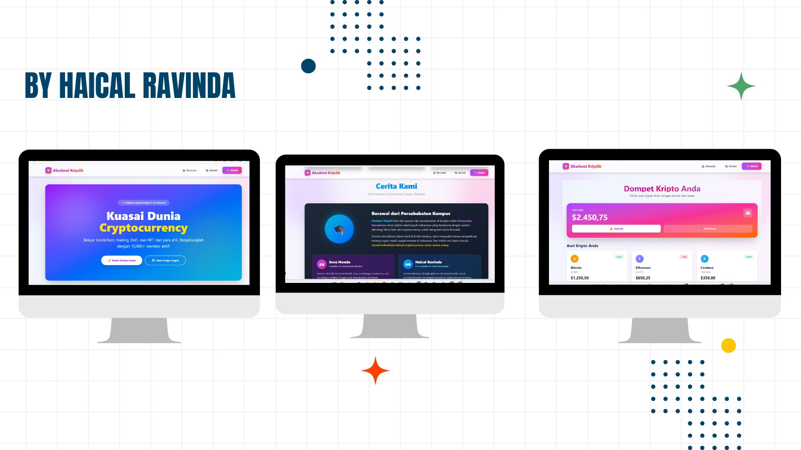

# Akademi Kripdick


**Akademi Kripdick** adalah website edukasi yang berisi informasi dan pembelajaran mengenai **kripto**. Website ini dibuat menggunakan **Next.js** dengan tujuan memberikan sumber belajar yang mudah diakses dan interaktif bagi pemula maupun profesional.

link demo website : https://akademi-crypd-2eqdkf4f4-haicalravindas-projects.vercel.app/

---

## 📸 Screenshot

  
*Halaman utama Akademi Kripdick*

---

## ✨ Fitur

- Informasi dan tutorial seputar **cryptocurrency**
- Tampilan modern dan responsif
- Navigasi mudah dan interaktif
- Optimasi font otomatis menggunakan `next/font`
- Mudah di-deploy di **Vercel**

---

## 🚀 Teknologi yang Digunakan

- [Next.js](https://nextjs.org) – Framework React untuk pengembangan web modern  
- [TypeScript](https://www.typescriptlang.org) – Superset JavaScript dengan tipe data statis  
- [React](https://reactjs.org) – Library untuk membangun UI  
- [Vercel](https://vercel.com/) – Platform untuk deploy dan hosting  

---

## 💻 Cara Memulai

1. Clone repository ini:
```bash
git clone https://github.com/username/akademi-kripdick.git
cd akademi-kripdick
